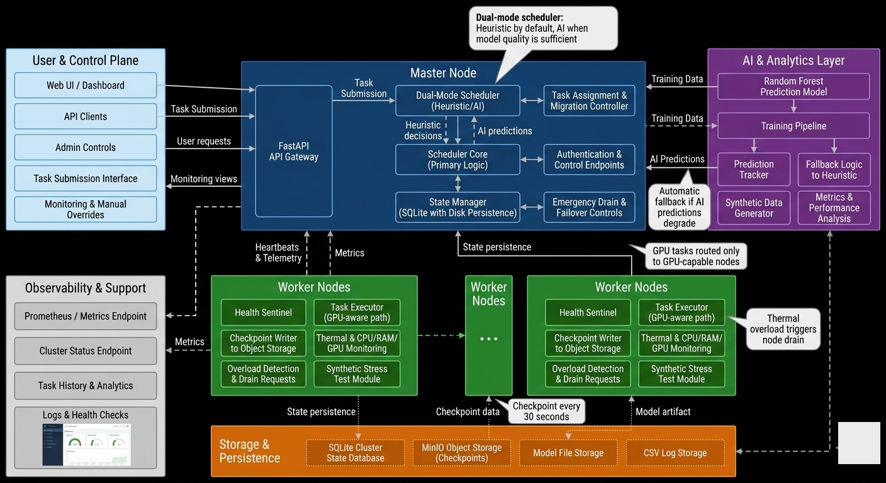

# NeuroCluster — Distributed AI Load Balancer

> A production-hardened, multi-machine distributed task execution engine with an AI-driven scheduler, real-time WebSocket dashboard, and voice-activated cluster monitoring.

<p align="center">
  
  
  
  
  
  
</p>

<p align="center">
  
</p>

---

## Table of Contents

- [Overview](#overview)
- [Architecture](#architecture)
- [Features](#features)
- [Project Structure](#project-structure)
- [Quick Start](#quick-start)
- [Configuration](#configuration)
- [API Reference](#api-reference)
- [AI Scheduler](#ai-scheduler)
- [Voice Assistant](#voice-assistant)
- [Worker Sentinel](#worker-sentinel)
- [Frontend Dashboard](#frontend-dashboard)
- [Training the Model](#training-the-model)
- [Network Setup (Multi-Machine)](#network-setup-multi-machine)
- [Failure Recovery](#failure-recovery)
- [Tech Stack](#tech-stack)

---

## Overview

NeuroCluster is a **capstone-grade distributed systems project** that simulates and manages real computational workloads across a cluster of machines. It combines:

- A **FastAPI master node** that coordinates all workers, tasks, and state
- **Worker sentinels** that stream live CPU/RAM/GPU/thermal metrics every second
- An **AI scheduler** (RandomForest) that predicts task duration and routes tasks optimally — with automatic fallback to a heuristic algorithm if model accuracy drops
- A **browser-based voice assistant** powered by the Web Speech API + Gemini for hands-free cluster querying
- A **full HTML/JS frontend** with real-time WebSocket updates for dashboards, task management, analytics, and more

---

## Architecture

```
┌─────────────────────────────────────────────────────────────────┐
│                        Frontend (HTML/JS)                        │
│  dashboard.html  tasks.html  analytics.html  voice-assistant.html│
│                 ↕ REST + WebSocket                               │
├─────────────────────────────────────────────────────────────────┤
│                   Master Node  (FastAPI)                         │
│                                                                  │
│  ┌──────────────┐  ┌─────────────────┐  ┌───────────────────┐  │
│  │ REST API     │  │  WebSocket      │  │  AI Scheduler     │  │
│  │ /api/v1/...  │  │  /ws/metrics    │  │  RandomForest +   │  │
│  │              │  │  500ms push     │  │  Heuristic Fallback│  │
│  └──────┬───────┘  └────────┬────────┘  └────────┬──────────┘  │
│         │                   │                     │              │
│  ┌──────┴────────────────────────────────────────┘              │
│  │              SQLite State Manager                             │
│  │  nodes · tasks · metrics tables                              │
│  └───────────────────────────────────────────────────────────── │
├─────────────────────────────────────────────────────────────────┤
│              Worker Nodes  (one per machine)                     │
│                                                                  │
│  ┌─────────────────────┐    ┌──────────────────────────────┐   │
│  │  HealthSentinel      │    │  TaskConsumer + TaskExecutor │   │
│  │  • CPU / RAM / Disk  │    │  • Pulls tasks from master   │   │
│  │  • Thermal (WMI/     │    │  • matrix_multiply           │   │
│  │    /sys thermal_zone)│    │  • compress_data             │   │
│  │  • NVIDIA GPU (NVML) │    │  • synthetic_load            │   │
│  │  • Heartbeat /1s     │    │  • Streams progress updates  │   │
│  └─────────────────────┘    └──────────────────────────────┘   │
└─────────────────────────────────────────────────────────────────┘
```

---

## Features

### Core Cluster
| Feature | Details |
|---|---|
| **Multi-machine support** | Master + N workers via LAN or Wi-Fi hotspot |
| **Real-time heartbeat** | Workers POST CPU/RAM/GPU/thermal every 1 second |
| **Task queue** | Submit, assign, cancel, and track tasks via REST API |
| **Task execution** | Workers pull and execute matrix, compression, and load tasks |
| **Auto-drain** | Worker self-requests drain when CPU+thermal threshold sustained |
| **Live WebSocket stream** | `/ws/metrics` pushes cluster state to all clients at 500ms |

### AI Scheduler
| Feature | Details |
|---|---|
| **Dual-mode scheduling** | AI (RandomForest) or Heuristic, togglable at runtime |
| **Prediction model** | Predicts task duration from type, size, node CPU/RAM/GPU |
| **Quality gate** | Model only activates if RMSE < 2.0 seconds |
| **Auto-fallback** | Switches to heuristic if MAPE > 30% for 3 consecutive tasks |
| **Feature importances** | Exposed via `/api/v1/scheduler/status` |

### Voice Assistant
| Feature | Details |
|---|---|
| **Browser STT/TTS** | Web Speech API — 100% free, no external STT service |
| **Gemini NLP** | Upgrades responses with conversational language when API key set |
| **Token-efficient** | Loads SOP.md context only for "how/why/explain" queries |
| **Local fallback** | Works without any API key using rule-based summarizer |
| **Wake word** | Wake-word loop support in `voice-assistant.html` |

### Frontend Pages
| Page | Description |
|---|---|
| `index.html` | Landing / marketing page |
| `dashboard.html` | Live cluster health — node cards, task table, scheduler controls |
| `tasks.html` | Full task management — submit, monitor, cancel |
| `analytics.html` | Success rates, avg CPU/RAM, node comparisons |
| `voice-assistant.html` | Hands-free voice interface |
| `login.html` / `register.html` | Auth pages (backed by `/api/v1/auth/*`) |
| `api-documentation.html` | Interactive API reference |
| `features.html`, `pricing.html`, `about.html` | Marketing pages |

### GPU Support
Workers detect NVIDIA GPUs via `pynvml` and include:
- GPU utilization (%)
- VRAM used (MB)
- GPU temperature (°C)
- GPU availability flag

GPU-aware task routing is respected by the AI scheduler.

---

## Project Structure

```
Ai_loadbalacer/
│
├── master/                    # Master node
│   ├── main.py                # FastAPI app, all REST endpoints
│   ├── scheduler.py           # AI + Heuristic scheduler
│   ├── state_manager.py       # SQLite wrapper (nodes, tasks, metrics)
│   ├── task_distributor.py    # Ray-aware task distribution
│   └── api/
│       └── websocket.py       # WebSocket broadcaster (/ws/metrics)
│
├── worker/                    # Worker node agents
│   ├── sentinel.py            # HealthSentinel + TaskConsumer (entry point)
│   ├── executor.py            # Task execution engine (with checkpointing)
│   ├── gpu_detector.py        # NVIDIA GPU detection via pynvml
│   ├── stress.py              # Lightweight stress runner
│   └── stress_test.py         # Synthetic profiles (light/medium/heavy)
│
├── ai/                        # Machine learning pipeline
│   ├── synthetic_generator.py # Generate training data (CSV)
│   ├── train_model.py         # Train + save RandomForest model
│   ├── agent_wrapper.py       # Agent task management + retry logic
│   ├── code_validator.py      # Multi-level code validation
│   └── models/                # Saved .pkl models (git-ignored)
│
├── shared/                    # Shared utilities
│   ├── config.py              # Pydantic settings loader from .env
│   ├── minio_client.py        # MinIO checkpoint storage wrapper
│   ├── voice_assistant.py     # Voice query → answer (Gemini / local)
│   └── self_correction.py     # Error detection, retry, auto-fix engine
│
├── dashboard/                 # Streamlit dashboard (alternative UI)
│   ├── components/            # Node cards, task tables, control panels
│   └── utils/                 # Auth helpers
│
├── getconnect (3)/getconnect/ # HTML/JS frontend (served by FastAPI)
│   ├── index.html             # Landing page
│   ├── dashboard.html         # Main cluster dashboard
│   ├── tasks.html             # Task management
│   ├── analytics.html         # Performance analytics
│   ├── voice-assistant.html   # Voice interface
│   ├── login.html             # Login page
│   ├── register.html          # Registration page
│   └── api-config.js          # Shared API base URL config
│
├── tests/                     # Pytest test suite
├── .agent/workflows/          # Workflow automation scripts
├── requirements.txt           # Python dependencies
├── SOP.md                     # Standard Operating Procedures
├── ORCHESTRATION_PLAN.md      # Agent build plan (all 6 waves)
└── .env                       # Environment config (not in git)
```

---

## Quick Start

### Prerequisites
- Python 3.11+
- (Optional) NVIDIA drivers + `pynvml` for GPU monitoring
- (Optional) `stress-ng` on Linux workers for synthetic load

### 1. Clone & Install

```bash
git clone https://github.com/Vinit1235/ai_load_balancer.git
cd ai_load_balancer
python -m venv .venv
# Windows:
.venv\Scripts\activate
# Linux/macOS:
source .venv/bin/activate

pip install -r requirements.txt
```

### 2. Configure Environment

Copy and edit `.env`:

```bash
cp .env.example .env   # or create manually
```

Minimum required variables:

```env
MASTER_HOST=0.0.0.0
MASTER_PORT=8000
DATABASE_PATH=cluster_state.db
DASHBOARD_PASSWORD=capstone2026
GEMINI_API_KEY=your_key_here        # Optional — for voice AI
```

### 3. Start the Master Node

```bash
uvicorn master.main:app --host 0.0.0.0 --port 8000 --reload
```

- API: `http://localhost:8000`
- Swagger UI: `http://localhost:8000/docs`
- Frontend: `http://localhost:8000/app`

### 4. Start Worker Sentinels

On each worker machine (or separate terminal):

```bash
python -m worker.sentinel --master-url http://<MASTER_IP>:8000 --node-name worker-1
```

To also pull and execute tasks:

```bash
python -m worker.sentinel --master-url http://<MASTER_IP>:8000 --node-name worker-1 --enable-task-consumer
```

---

## Configuration

All settings are loaded from `.env` via `shared/config.py`:

| Variable | Default | Description |
|---|---|---|
| `MASTER_HOST` | `0.0.0.0` | Master API bind address |
| `MASTER_PORT` | `8000` | Master API port |
| `DATABASE_PATH` | `cluster_state.db` | SQLite database file |
| `DASHBOARD_PASSWORD` | `capstone2026` | Streamlit dashboard password |
| `OVERLOAD_CPU_THRESHOLD` | `85` | CPU % threshold for drain trigger |
| `OVERLOAD_THERMAL_THRESHOLD` | `80` | Temperature °C threshold |
| `OVERLOAD_DURATION_SEC` | `10` | Seconds sustained before drain |
| `FORCE_HEURISTIC` | `0` | Set `1` to disable AI scheduler |
| `GEMINI_API_KEY` | _(empty)_ | Google Gemini API key for voice NLP |
| `LLM_MODEL` | `gemini-1.5-flash` | Gemini model ID |
| `LLM_TEMPERATURE` | `0.3` | Response creativity |
| `LLM_MAX_TOKENS` | `150` | Max voice response tokens |
| `CHECKPOINT_INTERVAL` | `30` | Seconds between task checkpoints |

---

## API Reference

Full interactive docs at `http://localhost:8000/docs`. Key endpoints:

### Tasks
| Method | Endpoint | Description |
|---|---|---|
| `POST` | `/api/v1/tasks` | Submit a new task |
| `GET` | `/api/v1/tasks` | List all tasks |
| `GET` | `/api/v1/tasks/{id}` | Get task details |
| `POST` | `/api/v1/tasks/assign` | Worker pulls next pending task |
| `POST` | `/api/v1/tasks/{id}/progress` | Update task progress/status |
| `POST` | `/api/v1/tasks/{id}/cancel` | Cancel a task |
| `DELETE` | `/api/v1/tasks/{id}` | Delete a task |

### Nodes
| Method | Endpoint | Description |
|---|---|---|
| `POST` | `/api/v1/nodes/heartbeat` | Worker heartbeat (CPU/RAM/GPU/thermal) |
| `GET` | `/api/v1/nodes` | List all active nodes |
| `GET` | `/api/v1/nodes/{node_id}` | Get individual node details |

### Cluster
| Method | Endpoint | Description |
|---|---|---|
| `GET` | `/api/v1/cluster/status` | Full cluster snapshot |
| `GET` | `/api/v1/display/status` | Display-ready cluster status |
| `GET` | `/api/v1/analytics` | Aggregated analytics payload |
| `GET` | `/api/v1/health` | Health check |

### Control
| Method | Endpoint | Description |
|---|---|---|
| `POST` | `/api/v1/control/drain/{node_id}` | Drain a node |
| `POST` | `/api/v1/control/migrate` | Force task migration |
| `POST` | `/api/v1/control/scheduler/mode` | Toggle AI / HEURISTIC mode |
| `GET` | `/api/v1/scheduler/status` | Scheduler mode, RMSE, predictions |

### Auth
| Method | Endpoint | Description |
|---|---|---|
| `POST` | `/api/v1/auth/register` | Register a new user |
| `POST` | `/api/v1/auth/login` | Login and receive token |

### Voice
| Method | Endpoint | Description |
|---|---|---|
| `POST` | `/api/v1/assistant/status` | Voice query → spoken answer |

### WebSocket
| Endpoint | Push interval | Description |
|---|---|---|
| `ws://host:8000/ws/metrics` | 500ms | Live cluster state broadcast |

---

## AI Scheduler

### How It Works

The scheduler has two modes, switchable at runtime via API:

**HEURISTIC mode** (default, always available):
```
score = (cpu_percent + ram_percent) × (1 + active_tasks × 0.2)
```
Picks the node with the **lowest score**.

**AI mode** (requires trained model):
- For each healthy node, creates a feature vector: `[task_type, input_size, cpu, ram, active_tasks, gpu_available]`
- RandomForest predicts how long the task will run on that node
- Adds an active-task penalty: `predicted + (active_tasks × 2.0)`
- Picks the node with the **lowest total**

### Automatic Fallback

The scheduler monitors prediction accuracy. If MAPE exceeds 30% for 3 consecutive tasks, it automatically switches back to HEURISTIC and logs a warning:

```
AUTO-FALLBACK: Switched to HEURISTIC mode due to poor predictions
```

---

## Training the Model

```bash
# 1. Generate synthetic training data
python -m ai.synthetic_generator --count 500 --output execution_logs.csv

# 2. Train the RandomForest
python -m ai.train_model --input execution_logs.csv --output ai/models/random_forest.pkl --min-rmse 2.0

# 3. Restart master — it auto-loads the model from ai/models/random_forest.pkl
```

The model only saves if RMSE < `--min-rmse`. Once loaded, the master exposes model RMSE, R², and feature importances via `/api/v1/scheduler/status`.

---

## Voice Assistant

The voice assistant consists of two parts:

**Frontend** (`voice-assistant.html`):
- Uses the browser's `SpeechRecognition` API (Chrome recommended) — free, no key needed
- Uses `SpeechSynthesis` for spoken replies
- Supports a configurable wake word (e.g., "Hey Cluster")
- Sends transcripts to the backend via `POST /api/v1/assistant/status`

**Backend** (`shared/voice_assistant.py`):
- Builds a compact cluster snapshot as context
- **Gemini mode**: Sends a token-efficient prompt to `gemini-1.5-flash` for natural language responses. Only loads `SOP.md` for `how/why/explain/recover` queries to save tokens.
- **Local fallback**: Rule-based answer using live `nodes_online`, `tasks_total`, `working`, `top_node` stats — works with zero API keys.

```bash
# Example query → answer
POST /api/v1/assistant/status
{ "query": "How many tasks are running?", "use_ai": true }

# Response
{
  "ok": true,
  "provider": "gemini",
  "answer": "Currently 3 tasks are running across 2 online nodes, with 1 task pending in the queue.",
  "snapshot": { ... }
}
```

---

## Worker Sentinel

The sentinel runs on each worker machine and does two things in parallel:

**HealthSentinel** — metrics + heartbeat loop:
- Collects CPU (psutil), RAM (psutil), disk usage
- Collects temperature: Linux `/sys/class/thermal/`, Windows WMI, psutil fallback
- Collects NVIDIA GPU metrics via `pynvml` (optional)
- POSTs all metrics to `POST /api/v1/nodes/heartbeat` every **1 second**
- Self-triggers drain if `CPU > 85%` AND `thermal > 80°C` sustained for 10s

**TaskConsumer** — task execution loop (optional):
- Polls `POST /api/v1/tasks/assign` every 3 seconds
- Executes acquired tasks via `TaskExecutor`: `matrix_multiply`, `compress_data`, `synthetic_load`
- Streams progress back to master via `POST /api/v1/tasks/{id}/progress`

---

## Frontend Dashboard

The frontend is a set of HTML/JS pages served by FastAPI as static files at `/app`.

**Key page: `dashboard.html`**
- Node cards with live CPU/RAM/status (🟢 HEALTHY · 🟠 DRAINING · 🔴 OFFLINE)
- Live task table with status colors and cancel buttons
- AI/Heuristic scheduler toggle
- WebSocket connection to `/ws/metrics` for 500ms live updates

**API config** (`api-config.js`): Single file that sets the base URL for all pages. Change `API_BASE_URL` here to point to a different master.

**Auth flow**: `login.html` → `POST /api/v1/auth/login` → JWT-style token stored in `localStorage`.

Demo credentials (auto-seeded on first startup):
- Email: `demo@getconnect.web`
- Password: `password123`

---

## Network Setup (Multi-Machine)

For a real cluster (e.g., 1 laptop as master, 2–3 other machines as workers):

### Option A — Same LAN
```bash
# Master on 192.168.1.100
uvicorn master.main:app --host 0.0.0.0 --port 8000

# Workers on 192.168.1.101, .102, etc.
python -m worker.sentinel --master-url http://192.168.1.100:8000 --node-name worker-1
```

### Option B — Mobile Hotspot (Recommended for demos)
```bash
# Master enables hotspot → hotspot gateway IP is 192.168.137.1
uvicorn master.main:app --host 0.0.0.0 --port 8000

# Workers connect to hotspot, then:
python -m worker.sentinel --master-url http://192.168.137.1:8000 --node-name worker-1
```

Verify connectivity:
```bash
curl http://192.168.137.1:8000/api/v1/cluster/status
```

---

## Failure Recovery

| Failure | Recovery |
|---|---|
| **AI model missing** | Scheduler auto-stays in HEURISTIC mode |
| **AI predictions degrade** | Auto-fallback to HEURISTIC after 3 bad consecutive predictions |
| **Worker goes offline** | Node disappears from `/api/v1/nodes` after heartbeat timeout |
| **Master crash** | Restart with `uvicorn master.main:app ...` — state restored from SQLite |
| **Task stuck** | Cancel via `POST /api/v1/tasks/{id}/cancel` or `DELETE /api/v1/tasks/{id}` |
| **Thermal overload** | Sentinel self-drains; tasks stay in queue for healthy nodes |

---

## Tech Stack

| Layer | Technology |
|---|---|
| **Backend** | Python 3.11, FastAPI, Uvicorn, Pydantic v2 |
| **State** | SQLite via `aiosqlite` |
| **ML Scheduler** | scikit-learn RandomForest, joblib, pandas, numpy |
| **Worker monitoring** | psutil, pynvml (NVIDIA GPU), platform WMI (Windows thermal) |
| **Distributed execution** | Ray (optional), httpx for worker↔master communication |
| **Real-time** | WebSockets via `websockets`, FastAPI WebSocket router |
| **Storage** | MinIO (S3-compatible) for task checkpoints |
| **Voice NLP** | Google Gemini (`google-generativeai`), Web Speech API |
| **Frontend** | HTML5, Vanilla JS, CSS — no framework |
| **Dashboard** | Streamlit + Plotly (alternative UI) |
| **Testing** | pytest, pytest-asyncio |

---

## License

MIT — see [LICENSE](LICENSE) for details.

---

<p align="center">Built as a capstone project · NeuroCluster Distributed AI Load Balancer</p>
