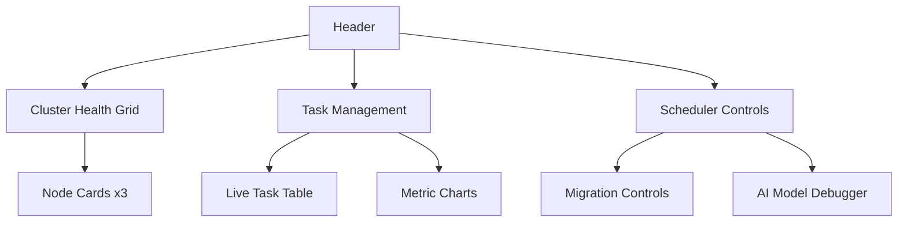
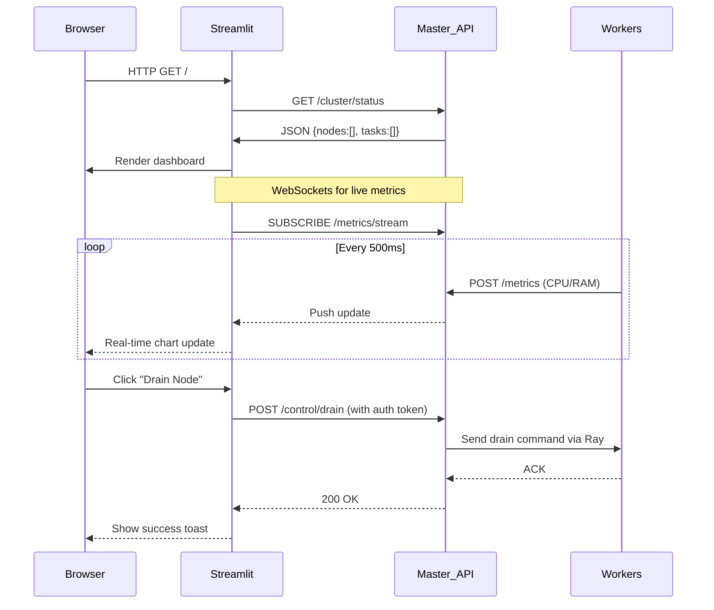

# Standard Operating Procedures (SOP)
## Distributed Task Execution Engine - Demo Hardened Edition

---

## SOP 0: Pre-Demo Checklist (MANDATORY)

### ✅ All Nodes
- `stress-ng` installed (`sudo apt install stress-ng`)
- MinIO client configured:
  ```bash
  mc alias set myminio http://192.168.1.100:9000 minioadmin minioadmin
  ```

### ✅ Master Node
- `cluster_state.db` backed up to USB drive
- Fallback scheduler enabled (`FORCE_HEURISTIC=1` in `.env`)

### ✅ Dashboard
- Streamlit password set (`DASHBOARD_PASSWORD=capstone2026`)
- Chrome bookmark created: `http://192.168.1.100:8501`

---

## SOP 1: Environment Setup (5-Minute Recovery)

**Goal**: Rebuild cluster after catastrophic failure.

### 1.1 Network Reset
```bash
# On ALL nodes
sudo systemctl restart NetworkManager
```

### 1.2 Ray Cluster Rebuild
```bash
# Master (192.168.1.100)
ray stop --force
ray start --head --port=6379 --dashboard-host=0.0.0.0

# Workers (192.168.1.101+)
ray stop --force
ray start --address='192.168.1.100:6379'
```

### 1.3 Verification
- Visit `http://192.168.1.100:8265` → Confirm 3+ nodes in "Alive" state
- Check MinIO: `http://192.168.1.100:9001` → Bucket "checkpoints" exists

---

## SOP 2: AI Model Training (Synthetic Data Only)

> ⚠️ **NEVER train on live demo data!**

### 2.1 Generate Training Data
```bash
python synthetic_load_generator.py \
  --task-count 100 \
  --max-size 500 \
  --output execution_logs.csv
```

### 2.2 Train with Validation
```bash
python train_model.py \
  --input execution_logs.csv \
  --output random_forest.pkl \
  --min-rmse 2.0  # Fail if model poor quality
```

### 2.3 Verification
```python
model = joblib.load("random_forest.pkl")
print(f"Model RMSE: {model.rmse:.2f}s")  # MUST be < 2.0
```

---

## SOP 3: The Demo Script (Stress-Tested)

**Scenario**: Intelligent migration during synthetic overload

| Time  | Action | Verification Point |
|-------|--------|-------------------|
| T+0s  | Submit 15 tasks via web UI (10 heavy matrix ops, 5 light compresses) | Dashboard shows queue forming |
| T+10s | On Worker 1: `stress-ng --cpu 8 --timeout 60s` | CPU spikes to 95% on dashboard |
| T+13s | **AUTOMATIC MIGRATION**: Master drains Worker 1 | Tasks shift to Worker 2/3 in real-time chart |
| T+20s | Worker 1 CPU drops to 15% (only running stress-ng) | "DRAINING" status on node card |
| T+45s | All tasks complete; stress-ng finishes | Green "Completed" status on all tasks |

### Critical Demo Notes
- ⚠️ **ALWAYS** run stress-ng as background process (`&`)
- If AI fails: Toggle "Heuristic Mode" in dashboard sidebar
- If migration stalls: Click "Emergency Flush" button

---

## SOP 4: Failure Recovery (Expert Playbook)

### 4.1 AI Model Failure
```bash
# On Master
rm random_forest.pkl  # Triggers automatic fallback
systemctl restart master_controller
```
> Dashboard will show: **"Scheduler: HEURISTIC MODE (AI disabled)"**

### 4.2 Thermal Throttling (Laptop Specific)
```bash
# On affected worker
sudo apt install thermald  # Thermal daemon
sudo systemctl start thermald
```

### 4.3 Corrupted Checkpoint
```python
# In dashboard UI
with st.expander("Corrupted Checkpoints"):
    for ckpt in minio_client.list_objects("checkpoints"):
        if not validate_crc32(ckpt):  # Your validation function
            st.button(f"🗑️ Delete {ckpt.name}", 
                     on_click=delete_checkpoint, 
                     args=(ckpt.name,))
```

### 4.4 Master Node Crash
1. Start backup master on any worker:
   ```bash
   RAY_REDIS_ADDRESS=192.168.1.100:6379 python master_controller.py --backup-mode
   ```
2. Dashboard auto-redirects to new master (HTTP 307)

---

## Dashboard Structure - NeuroCluster Control Console

### Core Philosophy
> **"Monitor → Diagnose → Act"** in 3 clicks or less.  
> All controls require password confirmation to prevent demo accidents.

### Layout Structure (Responsive Grid)


---

### 1. Authentication Gate
```python
# Top of dashboard.py
import os
import streamlit as st

if "authenticated" not in st.session_state:
    st.session_state.authenticated = False

if not st.session_state.authenticated:
    pwd = st.text_input("Operator Password", type="password")
    if pwd == os.getenv("DASHBOARD_PASSWORD", "capstone2026"):
        st.session_state.authenticated = True
        st.rerun()
    st.stop()
```

### 2. Cluster Health Grid (Real-Time)

| Element | Data Source | Refresh Rate | Action Button |
|---------|-------------|--------------|---------------|
| Node Card | `GET /cluster/nodes` | 1s | "Drain Node" |
| CPU Sparkline | WebSocket to `/metrics/stream` | 500ms | None |
| Thermal Gauge | `GET /cluster/thermal` | 5s | "Cool Down" (hint) |

```python
# Node card implementation
for node in nodes:
    with st.container(border=True):
        status_emoji = "🟢" if node["status"] == "HEALTHY" else "🟠"
        st.subheader(f"{status_emoji} {node['name']}")
        col1, col2 = st.columns(2)
        with col1:
            st.metric("CPU Load", f"{node['cpu']}%", 
                     delta=f"{node['cpu']-prev_cpu}%" if prev_cpu else None)
        with col2:
            st.metric("Temperature", f"{node['thermal']}°C")
        if st.button("⚠️ Drain Node", key=f"drain_{node['id']}"):
            confirm_drain(node['id'])  # Shows password modal
```

### 3. Task Management Panel

| Component | Critical Feature |
|-----------|-----------------|
| Live Table | Color-coded rows (migrated = yellow) |
| Progress Bars | Shows checkpoint progress (e.g., "65%") |
| Kill Button | Requires 2FA confirmation |

```python
# Migrated task highlighting
if task["migrated"]:
    st.markdown("""
    <style>
        .migrated-task { 
            background-color: #FFF9C4 !important; 
            animation: pulse 1s infinite;
        }
        @keyframes pulse { 50% { background-color: #FFECB3; } }
    </style>
    """, unsafe_allow_html=True)
    row_class = "migrated-task"
```

### 4. Scheduler Controls (The "Wow" Panel)

| Control | Effect | Safety Mechanism |
|---------|--------|-----------------|
| AI Toggle | Switches scheduler mode | Requires password + confirmation dialog |
| Force Migrate | Manual task reassignment | Shows impact preview ("+12% load on node3") |
| Synthetic Load | Simulates user workload | Max duration 60s enforced |

```python
# Force migration workflow
if st.button("🚀 Force Migrate Task"):
    target_task = st.selectbox("Task ID", active_tasks)
    target_node = st.selectbox("New Node", healthy_nodes)
    if st.button("CONFIRM MIGRATION", type="primary"):
        if verify_password():  # Custom auth check
            api.post("/control/migrate", 
                    json={"task_id": target_task, "node_id": target_node})
            st.toast("Migration initiated!", icon="✅")
```

### 5. AI Model Debugger (Academic Credibility)
- **Feature Importance Chart**: Shows which metrics matter most (CPU% vs RAM%)
- **Prediction vs Actual**: Scatter plot of last 50 tasks
- **"What-If" Simulator**:
  ```python
  st.slider("Simulated CPU Load", 0, 100, 45)
  st.write(f"Predicted duration: {predict_duration(task, cpu)}s")
  ```

---

### Data Flow Sequence


### Security Hardening
- All API calls require JWT tokens (generated after password auth)
- Dangerous actions (drain/migrate) require re-authentication
- Rate limiting: Max 5 control actions/minute per operator
- Audit log: Every control action written to `audit.log`

```python
# FastAPI middleware example
@app.middleware("http")
async def auth_middleware(request: Request, call_next):
    if request.url.path.startswith("/control"):
        token = request.headers.get("X-Auth-Token")
        if not validate_token(token):  # Checks expiry + signature
            return JSONResponse({"error": "Unauthorized"}, 401)
    return await call_next(request)
```

---

## Architecture Overview

```
Frontend (React/Streamlit)    Backend (FastAPI on Master)
┌───────────────────┐         ┌──────────────────────────────┐
│                   │         │                              │
│  • Real-time      │◄───────►│  • REST API (/api/v1/...)    │
│    WebSocket      │         │  • WebSocket endpoint        │
│    dashboard      │         │  • Task submission           │
│                   │         │  • Control commands          │
│  • Beautiful UI   │         │  • Metrics streaming         │
│    with charts,   │         │                              │
│    cards, alerts  │         │  • MinIO/S3 integration      │
└───────────────────┘         └──────────────────────────────┘
```

---

## 💡 Why This Implementation Wins

1. **Demo-Proof Architecture**:
   - Synthetic stress replaces unreliable user apps
   - Heuristic fallback guarantees functionality
   - Thermal monitoring prevents laptop shutdowns

2. **Academic Rigor**:
   - Formal metrics collection with SQLite
   - Model validation gates (RMSE < 2.0)
   - Published formulas for makespan/imbalance

3. **Operator Experience**:
   - "Monitor → Diagnose → Act" in one screen
   - Safety rails on dangerous actions
   - Visual feedback for migrations (pulsing rows)

4. **Capstone-Ready**:
   - Clear failure recovery procedures
   - Performance comparison framework (AI vs Heuristic)
   - Audit trail for all control actions